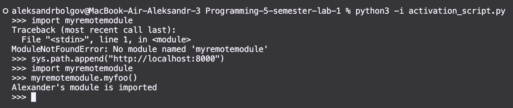
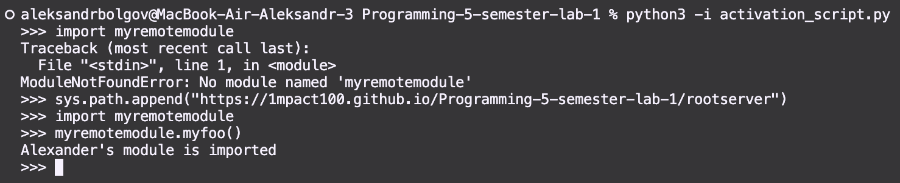
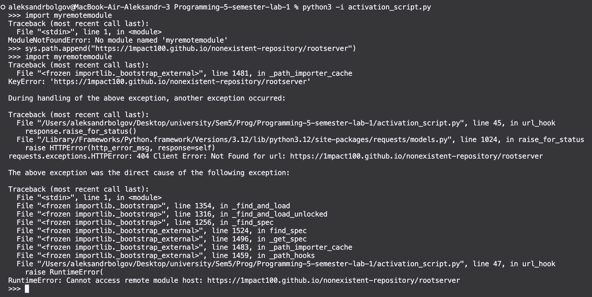

# Лабораторная работа 1. Реализация удалённого импорта

## Цель работы

Изучить механизм импорта модулей в Python и реализовать возможность загрузки Python-модуля из удалённого каталога по HTTP/HTTPS-адресу.

В работе реализованы:

- загрузка модуля из каталога, опубликованного через `http.server`;
- загрузка модуля с помощью GitHub Pages;
- обработка ошибок при недоступности удалённого хоста;
- переход от `urllib` к библиотеке `requests`.

## Структура проекта

```text
.
├── activation_script.py
├── rootserver/
│   ├── index.html
│   ├── myremotemodule.py
│   └── mypackage/
│       ├── index.html
│       ├── __init__.py
│       └── helper.py
├── screens/
│   ├── screen_1.png
│   ├── screen_2.png
│   └── screen_3.png
└── .gitignore
```

## Исходный модуль

Файл `rootserver/myremotemodule.py` содержит функцию, которая будет импортирована с удалённого сервера:

```python
def myfoo():
    author = "Alexander"
    print(f"{author}'s module is imported")
```

При успешном импорте и вызове функции:

```python
import myremotemodule
myremotemodule.myfoo()
```

выводится сообщение:

```text
Alexander's module is imported
```

## Реализация механизма импорта

Основной код находится в файле `activation_script.py`.

### `URLLoader`

Класс `URLLoader` отвечает за загрузку и выполнение найденного Python-модуля.

Метод `create_module()` возвращает `None`, поэтому объект модуля создаётся стандартным механизмом Python.

Метод `exec_module()` выполняет следующие действия:

1. получает URL модуля из `module.__spec__.origin`;
2. отправляет HTTP-запрос с помощью `requests.get()`;
3. проверяет HTTP-статус через `response.raise_for_status()`;
4. получает исходный код в виде байтов через `response.content`;
5. компилирует код с помощью `compile()`;
6. выполняет его в пространстве имён модуля с помощью `exec()`.

Фрагмент загрузки модуля:

```python
response = requests.get(module.__spec__.origin, timeout=5)
response.raise_for_status()
source = response.content
code = compile(source, module.__spec__.origin, mode="exec")
exec(code, module.__dict__)
```

### `URLFinder`

Класс `URLFinder` является поисковиком модулей для одного URL.

При создании он получает:

- адрес удалённого каталога;
- множество имён доступных Python-модулей.

Метод `find_spec()` получает имя импортируемого модуля. Если имя найдено среди доступных файлов, формируется полный URL:

```text
https://example.github.io/repository/rootserver/myremotemodule.py
```

После этого создаётся объект `ModuleSpec`, связывающий имя модуля с `URLLoader`.

### `url_hook`

Функция `url_hook()` подключается к списку обработчиков путей:

```python
sys.path_hooks.append(url_hook)
```

Когда в `sys.path` добавляется HTTP-адрес, Python вызывает эту функцию.

Функция выполняет следующие действия:

1. проверяет, что путь начинается с `http` или `https`;
2. скачивает HTML-страницу удалённого каталога через `requests`;
3. извлекает из HTML имена файлов с расширением `.py` регулярным выражением;
4. удаляет расширение `.py`, получая имена модулей;
5. возвращает объект `URLFinder`.

```python
filenames = re.findall(
    r"[a-zA-Z_][a-zA-Z0-9_]*\.py",
    data
)
modnames = {name[:-3] for name in filenames}
```

Таким образом, Python получает дополнительный источник поиска модулей, расположенный по HTTP/HTTPS-адресу.

## Первый вариант: локальный HTTP-сервер

Сначала каталог `rootserver` был использован как корень локального HTTP-сервера.

В первом терминале выполнялась команда:

```bash
cd rootserver
python3 -m http.server
```

По умолчанию сервер становился доступен по адресу:

```text
http://localhost:8000/
```

Во втором терминале запускался интерактивный Python:

```bash
python3 -i activation_script.py
```

После добавления адреса сервера в `sys.path` выполнялся импорт:

```python
sys.path.append("http://localhost:8000/")
import myremotemodule
myremotemodule.myfoo()
```

Результат первого варианта:



## Второй вариант: GitHub Pages

Для GitHub Pages в каталоге `rootserver` был создан файл `index.html`:

```html
<!DOCTYPE html>
<html lang="en">
<head>
    <meta charset="UTF-8">
    <title>Remote Python modules</title>
</head>
<body>
    <h1>Available Python modules</h1>
    <a href="myremotemodule.py">myremotemodule.py</a>
</body>
</html>
```

Файл необходим потому, что `url_hook()` анализирует HTML-страницу и ищет в ней имена Python-файлов. В отличие от локального `http.server`, GitHub Pages не обязан автоматически создавать список файлов каталога.

После отправки файлов в репозиторий GitHub Pages был настроен на публикацию ветки `main` из корня репозитория.

Так как нужные файлы расположены в `rootserver`, в `sys.path` добавлялся адрес каталога:

```python
sys.path.append(
    "https://1mpact100.github.io/Programming-5-semester-lab-1/rootserver/"
)
```

После этого выполнялся тот же импорт:

```python
import myremotemodule
myremotemodule.myfoo()
```

Результат второго варианта:



## Обработка недоступного хоста

Для обработки сетевых ошибок в `url_hook()` и `URLLoader` используется конструкция `try-except`:

```python
try:
    response = requests.get(url, timeout=5)
    response.raise_for_status()
except requests.exceptions.RequestException as error:
    raise RuntimeError(
        f"Cannot access remote module host: {url}"
    ) from error
```

`requests.exceptions.RequestException` охватывает основные ошибки сетевого запроса:

- невозможность установить соединение;
- истечение времени ожидания;
- ошибки DNS;
- HTTP-ошибки, например `404` или `500`.

Параметр `timeout=5` ограничивает время ожидания ответа сервера.

Конструкция `raise ... from error` создаёт новое понятное исключение и одновременно сохраняет исходную ошибку как его причину.

Для проверки использовалась неправильная ссылка на GitHub Pages. В результате вместо успешного импорта выводилось сообщение о недоступности удалённого хоста.

Результат проверки обработки исключения:



## Задание про-уровня: загрузка пакета

Дополнительно реализована загрузка удалённого пакета `mypackage`.

Пакет содержит файл `__init__.py` и вложенный модуль `helper.py`:

```text
mypackage/
├── index.html
├── __init__.py
└── helper.py
```

Для пакета `URLFinder` создаёт спецификацию с параметром:

```python
spec_from_loader(
    name,
    loader,
    origin=origin,
    is_package=True
)
```

В качестве `origin` используется файл:

```text
mypackage/__init__.py
```

Дополнительно задаётся `spec.submodule_search_locations`, содержащий URL каталога пакета. Благодаря этому Python понимает, где искать вложенные модули при выполнении:

```python
import mypackage.helper
```

Проверка выполняется следующим образом:

```python
import mypackage
mypackage.package_function()

import mypackage.helper
mypackage.helper.helper_function()
```

Ожидаемый результат:

```text
Package imported
Helper module imported
```

## Результат работы

В ходе лабораторной работы реализован механизм удалённого импорта Python-модулей. Один и тот же модуль был успешно загружен:

1. с локального HTTP-сервера;
2. с GitHub Pages.

Также была добавлена обработка ошибок при недоступности удалённого хоста и при невозможности загрузить конкретный файл модуля.

Кроме того, реализована загрузка пакета с файлом `__init__.py` и вложенным модулем.

Для HTTP-запросов используется библиотека `requests`, а подключение механизма к стандартному импортёру Python выполняется через `sys.path_hooks`.

Работу выполнил: Болгов Александр, группа ИВТ-2
